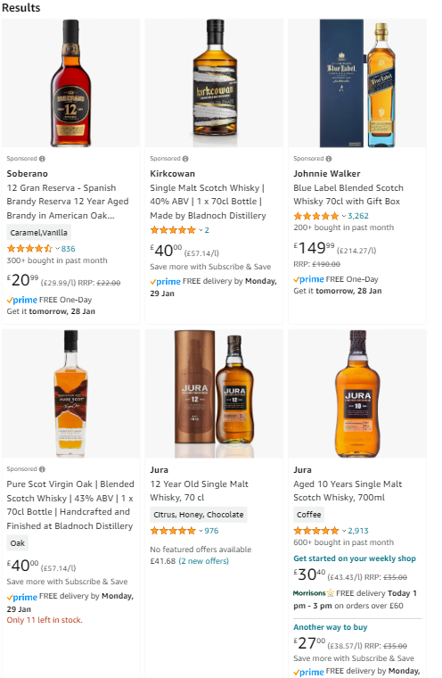
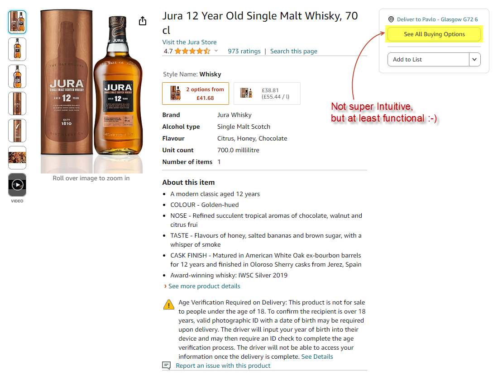
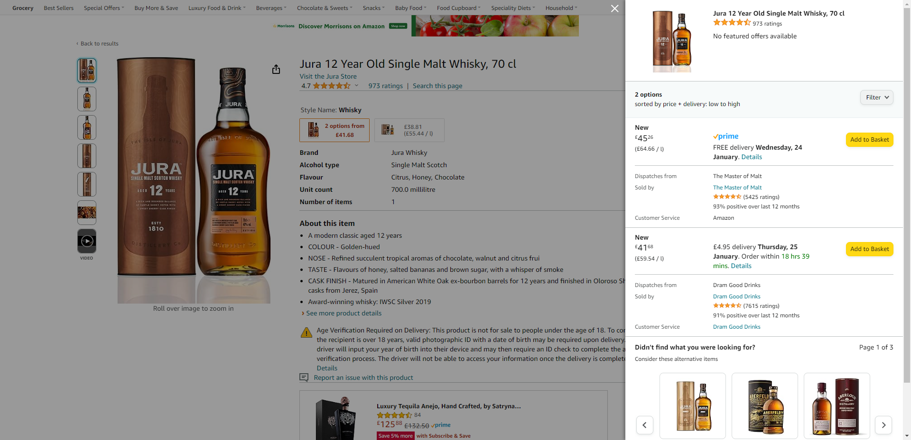
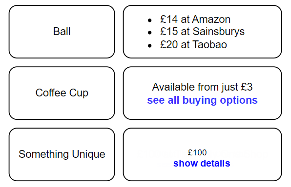

# Level 2

At the high-level, your task here is to "merry" the existing front-end with the [cyf-commerce-api](https://github.com/UAFramework/sql-homework/blob/main/3-ecommerce-db/projects/task.md) back-end which is familiar to you from one of the previous tasks.

## Implementation

1. Convert this react front-end project into `Node JS yarn` project with two workspaces in it: `client` and `server`.

    - `client` folder should contain this react front-end.
    - `server` folder should contain your files from the [cyf-commerce-api](https://github.com/UAFramework/sql-homework/blob/main/3-ecommerce-db/projects/task.md) project.

    __Note__: remember, you can find template for yarn workspaces in this [package.json](https://github.com/UAFramework/node-1-homework/blob/feature/Denis-corrected/package.json) file.

2. Now, you gonna need to refactor this whole project a little bit. The proposed bellow business logic is based on how Amazon Website works. 
    
    Say, you are a Whiskey lover. And wanna see what's Amazon offering you today. Here's how your search results might look like:
  
    
  
    Note, there is a bunch of products at the resulting page and almost all of them have their prices displayed, except one: `Jura 12yo Single Malt` (the middle bottom one). And another item, `Jura 10yo Single Malt` has 2 prices. Most probably Morrisons store pays extra money to Amazon for their marketing and that's why its higher price for Jura 10yo is displayed. 

    But what about Jura 12yo? This one also has multy-buying options: [Jura 12 Year Old Single Malt Whisky, 70 cl](https://www.amazon.co.uk/dp/B07BPNP8W2/).

    

    And apparently no one from the suppliers pays extra for the advertisement at Amazon, coz we can see more availability options if we go to its card and click `See All Buying Options` button:

    

    So let's try and implement similar logic in this project, shall we? 

    In order to implement something similar in this small e-commerce project, let's add two more REST api end-pints to the back-end server:

      - `GET /availability` - this end-point should return response with the schema bellow:
      
      ```json
      {
        "availability": object [
          {
            "product_id": numeric,
            "product_name": string,
            "min_unit_price": numeric,
            "supp_count": numeric
          }
        ]
      }
      ```
      
      - `GET /availability/product-id/:productId` - this should return response with the schema bellow:

      ```json
      {
        "productId": numeric,
        "availability": object [
          {
            "supplier_id": numeric,
            "supplier_name": string,
            "unit_price": numeric
          }
        ]
      }
      ```
      which is detailed availability info for a particular product Id.

    Here, when you see something like this: `"availability": object[...]` you should understand that the value for the `availability` key in the given response represents an array of objects, which looks like this:
    ```json
    {
      "availability": [
        {
          "supplier_id": 1,
          "supplier_name": "Amazon",
          "unit_price": 25.0
        },
        {
          "supplier_id": 2,
          "supplier_name": "Morrisons",
          "unit_price": 30.0
        }
      ]
    }
    ```

    That schema just describes the object structure, showing what key-names it has and what data types are used for those keys. 

3. In order to complete that at the front-end side, you'll need to learn [React Hooks](https://react.dev/reference/react/hooks):

    - [useState](https://react.dev/reference/react/useState): use this react hook for keeping some important data in a safe place inside the component. This is like component's internal data storage. React uses it when it needs to re-draw the component in case if re-rendering is initiated by the parent component or by an event handler in the component itself.
    - [useEffect](https://react.dev/reference/react/useEffect) - use this react hook, to tell react component that it needs to do something asynchronously (for example: fetch data from a REST API) and use result when rendering itself. Effectively how it works is: react initially renders component with no data data in it. And at the same time it launches that async call in `useEffect`. Once that async call completes react takes its result and updates the component and any dependent components if there are any.

4. Refactor your front-end page so that:
    - if there is only one available supplier for the product - just render its details for example: `£14 at Sainsburys`
    - if there are multiple suppliers available, show min available price "from" and a clickable link or button to let user click on it and reveal all the available options:

      First render: \
      
      
      Options for Ball clicked: \
      
  
  In order to do this, you need to arrange your components as below:

  ```
    |----------|
    | Product  |
    |----------|
          ^
          |_
            |
            |
      -----------------------
      | ProductAvailability |
      -----------------------
  ```
    
  - Product - is a parent component that should get data from `GET /availability` api and depending on the data received it implements the following business logic:
    
    - displays Product Name
    - passes to the ProductAvailability component necessary properties for it to display availability summary, i.e: `Available from just £14, see all buying options`. Think about what other attributes you need to pass to the ProductAvailability component?
    
  - ProductAvailability - is a child component for Product. It gets "Availability" data with props from its parent Product component. ProductAvailability component should display its content conditionally:

    - if there is no supplying options available (`supp_count == 0` in the parent component), ProductAvailability should display a text saying: `Currently out of stock`
    - in case if there is only one supplying option available (`supp_count == 1`) it should display min_unit_price, for example `£10` and a link saying `see more details`
      - if that link gets clicked, it should ProductAvailability component should change from `£10` to `£10 at <Whatever Supplier Name>`
    - in case there are multiple price options available then ProductAvailability toggles between the 2 other displays:
      - toggled into "summary mode"
        ```
        Available from just £14 
        see all buying options`: 
        ```
        where £14 is the min_unit_price
      - all available options if toggled into the full mode:
        ```
        £14 at Amazon
        £15 at Sainsburys
        £20 at Taobao
        ```
  - You'll need to create a state variable inside of each ProductAvailability component, that should be used to keep availability details.
  - You should implement handler with Fetch API in your ProductAvailability that will pull data from `GET /availability/product-id/:productId` whenever link for buying options is clicked.